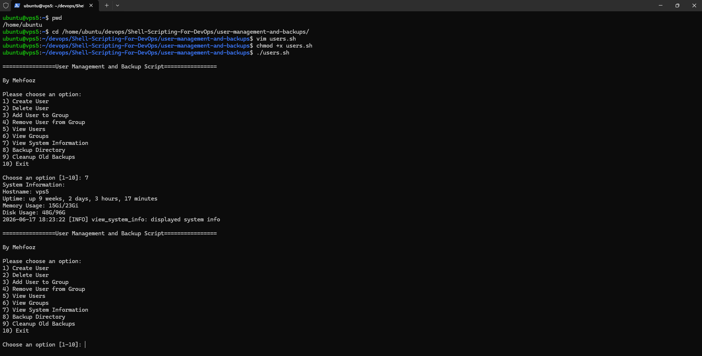

# User Management and Backups with Bash Scripting

This repository contains a comprehensive interactive bash script designed for DevOps engineering tasks. It simplifies user management, system monitoring, and automated backups on Linux systems through an easy-to-use menu-driven interface.

<div align="center">
  
</div>

## 🚀 Features

The `users-backups.sh` script provides the following capabilities:

### 👤 User & Group Management

- **Create User**: Easily create new users, with an option to create a home directory or not.
- **Delete User**: Remove users securely from the system.
- **Manage Groups**: Add or remove users from specific groups.
- **View Lists**: Display a list of all current users and groups on the system.

### 💻 System Information

- **View System Info**: Instantly check essential system metrics, including:
  - Hostname
  - System Uptime
  - Memory Usage (Used/Total)
  - Disk Usage (Used/Total for the root filesystem)

### 🗄️ Backup Management

- **Create Backups**: Backup any specified directory. The script archives it as a `.tar.gz` file with a timestamped filename, saved to the `backups/` directory.
- **Cleanup Old Backups**: Automatically find and remove old backups (older than 7 days) to free up disk space.

### 📝 Logging

- All operations (INFO, WARN, ERROR) are logged automatically to `logs/operations.log` with a timestamp, ensuring an audit trail for your DevOps activities.

## 🛠️ How it Works

The script is entirely interactive. When you run it, you'll be greeted with a menu:

```bash
================User Management and Backup Script================

By Mehfooz

Please choose an option:
1) Create User
2) Delete User
3) Add User to Group
4) Remove User from Group
5) View Users
6) View Groups
7) View System Information
8) Backup Directory
9) Cleanup Old Backups
10) Exit
```

Simply input the number corresponding to the task you want to perform and follow the prompts!

## 🏃‍♂️ Usage

1. Clone the repository.
2. Make the script executable:

   ```bash
   chmod +x users-backups.sh
   ```

3. Run the script (requires `sudo` for user/group management commands):

   ```bash
   ./users-backups.sh
   ```

## 📂 Directory Structure

Running the script will automatically generate the following directories if they don't exist:

- `logs/` - Stores `operations.log`.
- `backups/` - Stores your `.tar.gz` backup archives.
